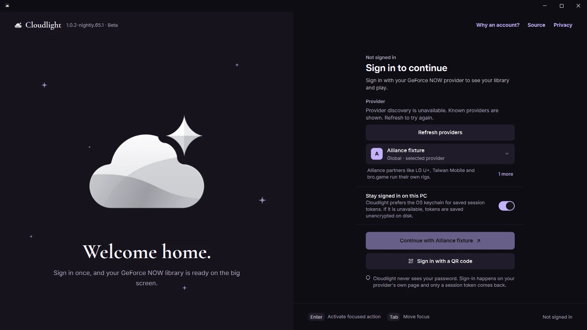
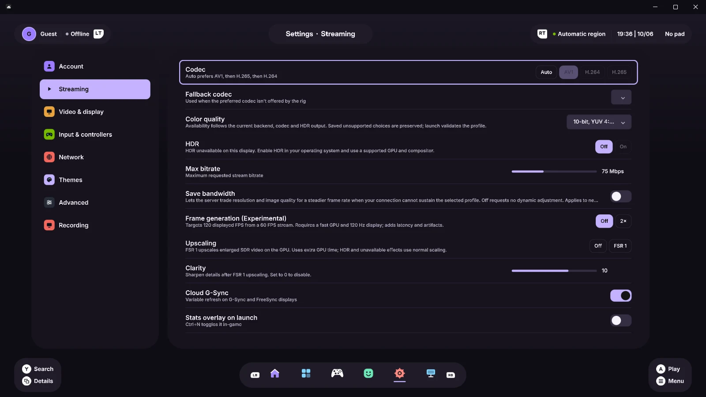

<p align="center">
  
</p>

<p align="center"><strong>Your GeForce NOW games, in an app that feels nice to use.</strong></p>

<p align="center">
  <a href="https://github.com/miirys/OpenNOW/releases/latest"></a>
</p>

## So what is this?

Cloudlight is an app for playing GeForce NOW. You sign in with your normal GeForce NOW
account, pick a game from your library and play it, same as the official app. The
difference is how it looks and feels: a calmer white, black and lavender look, a
proper couch mode for controllers, and settings that actually explain themselves.

It works with a mouse and keyboard on a desk, or with a controller from the sofa. You
can flip between the two whenever you like.

<p align="center">
  
</p>

<p align="center">
  
</p>

## A few things to know first

- You need your own GeForce NOW membership. What you can play, and at what quality,
  depends on your plan, where you live and your computer.
- Cloudlight isn't made by NVIDIA and NVIDIA doesn't support it. GeForce NOW is
  NVIDIA's service and their trademark.
- It's still being worked on, so expect the odd bug, especially with streaming on
  less common graphics cards.
- Cloudlight doesn't collect any data about you. There's no tracking and no analytics.

## Getting it

Grab the newest version from the [Releases page](https://github.com/miirys/OpenNOW/releases/latest).
Right now that's Windows only.

Download the `.zip`, unzip the whole folder and open `bin/Cloudlight.exe`. The builds
aren't signed yet, so Windows might warn you about an unknown publisher. That's
expected. Click "More info" and then "Run anyway".

Want the very latest changes before they're released? Sign in to GitHub, open the
[Actions page](https://github.com/miirys/OpenNOW/actions), click the newest run with a
green tick and download the build under "Artifacts".

## What you can do with it

- Browse the store, save favourites and sort your games into your own collections.
- Pick your resolution, frame rate, quality and codec, within what your plan allows.
- Open the in-game menu with Ctrl+G for stats, filters, screenshots and settings,
  without the game stopping.
- Record clips and take screenshots. You'll find them in the Media tab.
- If something goes wrong, go to Settings, then About, and save a diagnostics report.
  It helps a lot when you report a bug.

## Something not working?

Open an [issue](https://github.com/miirys/OpenNOW/issues) and tell us what happened,
what you were doing, and which computer and graphics card you have. If it's about the
stream itself, attach a diagnostics report. Have a quick look through it first in case
there's anything personal in there.

## Where it came from

Cloudlight started life as a fork of [OpenNOW](https://github.com/OpenCloudGaming/OpenNOW),
a community-made GeForce NOW app. A huge thanks to everyone who built it. Cloudlight
keeps its engine and gives it a new look and a lot of polish on top.

## For tinkerers

If you want to build it yourself, you'll need Qt 6.8 or newer, CMake, a C++ compiler,
Rust and SDL3. Then:

```sh
git clone https://github.com/miirys/OpenNOW.git
cd OpenNOW
cmake -S opennow-qt -B build/opennow-qt -DCMAKE_BUILD_TYPE=Release
cmake --build build/opennow-qt
```

The folders still use the old OpenNOW names on the inside so nothing breaks. The
[contributing guide](.github/CONTRIBUTING.md) has the rest.

## License

MIT. See [LICENSE](LICENSE).
